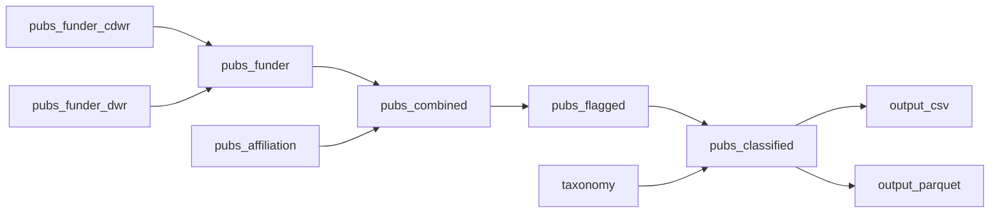

# DWR Publication Inventory — Analysis Plan

## Overview

This project produces a flat tabular inventory of peer-reviewed publications
funded and/or authored by the California Department of Water Resources (DWR),
with each publication classified into a user-defined scientific field taxonomy
using a large language model.

The pipeline is orchestrated with the
[`targets`](https://docs.ropensci.org/targets/) package. All bibliometric
retrieval and LLM classification is handled by the
[`pubclassify`](https://github.com/lucy-dwr/pubclassify) package.

---

## Repository Structure

```
_targets.R              # Pipeline declaration (targets DAG only)
setup.R                 # One-time dev setup (load pubclassify from local path)
R/                      # Custom functions, sourced by tar_source("R/")
taxonomy/
  dwr_taxonomy.csv      # Field taxonomy (columns: field, definition)
data/
  dwr_publications.csv     # Flat output with list columns as semicolon strings
  dwr_publications.parquet # Full-fidelity output with native list columns
```

---

## Configuration

Credentials are loaded from environment variables at pipeline runtime via
`pc_configure()`. The following environment variables must be set:

| Variable                  | Purpose                                      |
|---------------------------|----------------------------------------------|
| `SCOPUS_API_KEY`          | Elsevier Scopus API key                      |
| `SCOPUS_INSTTOKEN`        | Elsevier institutional token (COMPLETE view) |
| `PUBCLASSIFY_LLM_KEY`     | API key for the OpenAI-compatible LLM        |
| `PUBCLASSIFY_LLM_BASE_URL`| `https://customeruat.sda.state.ca.gov/api/v1`|
| `PUBCLASSIFY_EMAIL`       | Email for OpenAlex polite pool (optional)    |

`pc_configure()` is called once at the top of `_targets.R` (not as a target).

---

## Pipeline

### Target DAG



---

### Target Descriptions

#### `taxonomy`

Load the custom field taxonomy from `taxonomy/dwr_taxonomy.csv` using
`pc_taxonomy()`. The CSV must have exactly two columns: `field` and
`definition`. This target will be invalidated automatically if the taxonomy
file changes, triggering reclassification.

```r
tar_target(
  taxonomy,
  pc_taxonomy("taxonomy/dwr_taxonomy.csv"),
  # Mark the CSV as a file dependency so edits invalidate this target
  # (wrap with tar_target format = "file" + read pattern, or use
  # a tarchetypes::tar_file_read() approach — to be decided at implementation)
)
```

---

#### `pubs_funder_cdwr`

Search Scopus for publications acknowledging DWR as a funder using the precise
California-specific query.

```r
tar_target(
  pubs_funder_cdwr,
  pc_search_scopus(
    query      = "California Department of Water Resources",
    field      = "funder",
    doc_type   = c("article", "review"),
    auto_fetch = FALSE
  )
)
```

---

#### `pubs_funder_dwr`

Search Scopus using the shorter query to catch publications that acknowledge
DWR without the "California" prefix. Results will require disambiguation (see
Step `pubs_funder`).

```r
tar_target(
  pubs_funder_dwr,
  pc_search_scopus(
    query      = "Department of Water Resources",
    field      = "funder",
    doc_type   = c("article", "review"),
    auto_fetch = FALSE
  )
)
```

---

#### `pubs_funder`

Combine `pubs_funder_cdwr` and `pubs_funder_dwr`, deduplicate by DOI, and apply
a post-hoc filter to remove non-California DWR results introduced by the
broader query.

**Disambiguation strategy — to be refined.** Candidate approaches:

- Drop any record that also appears in `pubs_funder_cdwr` (already covered by the
  precise query).
- Inspect the `funders` and `grant_numbers` columns for geographic indicators:
  - DWR contract numbers often begin with `4600`; `pc_search_scopus()`'s
    `award_pattern = "^4600"` argument can flag these automatically.
  - Retain records from `pubs_funder_dwr` only if they contain a `4600`-prefix
    grant number or a California-affiliated author.
- Any remaining ambiguous records that cannot be resolved programmatically are
  flagged for manual review.

The final disambiguation logic will be implemented as a custom function in
`R/` and documented here once the approach is confirmed.

---

#### `pubs_affiliation`

Search Scopus for publications where at least one author is affiliated with
DWR. The full name "California Department of Water Resources" is used since this
is how DWR authors tend to report their affiliation; no disambiguation will be 
needed.

```r
tar_target(
  pubs_affiliation,
  pc_search_scopus(
    query      = "California Department of Water Resources",
    field      = "affiliation",
    doc_type   = c("article", "review"),
    auto_fetch = FALSE
  )
)
```

---

#### `pubs_combined`

Combine `pubs_funder` and `pubs_affiliation` into a single deduplicated
tibble, tracking which search(es) each DOI came from before deduplication.
The source provenance columns (`from_funder`, `from_affiliation`) are used in
the next step to compute DWR contribution flags.

Deduplication is handled by `pc_deduplicate()`, which prefers the richest
record when a DOI appears in both result sets.

---

#### `pubs_flagged`

Add four boolean contribution columns to `pubs_combined`. These flags are not
mutually exclusive — a publication can have any combination set.

| Column           | Definition                                |
|------------------|-------------------------------------------|
| `is_funder`      | DWR is acknowledged as a funder           |
| `is_author`      | At least one author is DWR-affiliated     |
| `is_lead_author` | The first-listed author is DWR-affiliated |
| `is_sole_author` | All authors are DWR-affiliated            |

The flags are nested: `is_sole_author → is_lead_author → is_author`. A record
can have `is_funder = TRUE` and any combination of authorship flags set
simultaneously.

- `is_funder` is derived from `from_funder` provenance.
- `is_author` is derived from `from_affiliation` provenance.
- `is_lead_author` is computed by checking whether the first element of the
  `affiliations` list-column contains `"California Department of Water
  Resources"`.
- `is_sole_author` is computed by checking whether every element of the
  `affiliations` list-column contains `"California Department of Water
  Resources"`.

---

#### `pubs_classified`

Classify each publication into a scientific field from the taxonomy using the
OpenAI-compatible LLM endpoint hosted by the California Department of
Technology. Classification uses title and abstract as input text.

```r
tar_target(
  pubs_classified,
  pc_classify(
    pubs      = pubs_flagged,
    taxonomy  = taxonomy,
    provider  = "openai-compatible",
    model     = "<model name TBD>",
    api_key   = Sys.getenv("PUBCLASSIFY_LLM_KEY"),
    base_url  = Sys.getenv("PUBCLASSIFY_LLM_BASE_URL")
  )
)
```

The LLM model name is to be confirmed. Because the taxonomy has fewer than 40
fields, `use_embeddings = FALSE` (the default) is appropriate.

A custom `system_prompt` and `classify_instructions` should be developed and
passed to `pc_classify()` to guide the model. This will be drafted once the
taxonomy fields are finalized.

---

#### `output_csv`

Write a flattened version of the classified tibble to
`data/dwr_publications.csv`. List columns (`authors`, `affiliations`,
`funders`, `grant_numbers`) are collapsed to semicolon-delimited strings so
the file is readable in Excel and other tabular tools without any special
handling.

```r
tar_target(
  output_csv,
  {
    collapse_list_col <- function(x) {
      vapply(x, function(v) paste(v, collapse = "; "), character(1L))
    }
    flat <- dplyr::mutate(
      pubs_classified,
      dplyr::across(c(authors, affiliations, funders, grant_numbers),
                    collapse_list_col)
    )
    readr::write_csv(flat, "data/dwr_publications.csv")
    "data/dwr_publications.csv"
  },
  format = "file"
)
```

---

#### `output_parquet`

Write the classified tibble to `data/dwr_publications.parquet` using the `arrow`
package. List columns are preserved as Arrow list type, making this the
preferred format for downstream applications (e.g., Shiny, Streamlit,
TypeScript/React via DuckDB-WASM) that need the full structured data.

```r
tar_target(
  output_parquet,
  {
    arrow::write_parquet(pubs_classified, "data/dwr_publications.parquet")
    "data/dwr_publications.parquet"
  },
  format = "file"
)
```

---

## Output Schema

The pipeline produces two output files from the same underlying data:

| File                          | List columns  | Best for                              |
|-------------------------------|---------------|---------------------------------------|
| `data/dwr_publications.csv`   | Semicolon-delimited strings | Excel, simple tabular tools |
| `data/dwr_publications.parquet` | Native list type | Shiny, Streamlit, React/DuckDB  |

Both files contain the standard `pubclassify` columns plus the columns
added by this pipeline:

| Column             | Description                                              |
|--------------------|----------------------------------------------------------|
| `doi`              | Digital Object Identifier                                |
| `title`            | Article title                                            |
| `abstract`         | Article abstract                                         |
| `year`             | Publication year                                         |
| `doc_type`         | Document type (article, review, etc.)                    |
| `authors`          | Author display names (list column)                       |
| `affiliations`     | Institutional affiliations per author (list column)      |
| `funders`          | Funder names (list column)                               |
| `grant_numbers`    | Grant/contract numbers (list column)                     |
| `journal`          | Journal name                                             |
| `source`           | API source (`"scopus"`)                                  |
| `is_funder`        | DWR is a funder (boolean)                                |
| `is_author`        | At least one DWR author (boolean)                        |
| `is_lead_author`   | First author is DWR-affiliated (boolean)                 |
| `is_sole_author`   | All authors are DWR-affiliated (boolean)                 |
| `pc_field`         | Assigned taxonomy field                                  |
| `pc_rationale`     | LLM rationale for field assignment                       |
| `pc_text_source`   | Text used for classification (`"title+abstract"`)        |
| `pc_classified_by` | Classification method (`"llm-full"`)                     |

---

## Open Questions / Deferred Decisions

- **Funder disambiguation logic** — the precise programmatic filter for
  removing non-California DWR results from `pubs_funder_dwr` is TBD. The
  `award_pattern = "^4600"` approach (DWR contract numbers) is a leading
  candidate and should be explored against real search results.

- **LLM model name** — the specific model to pass to `pc_classify()` via the
  California Department of Technology gateway is TBD.

- **Classification prompts** — a custom `system_prompt` and
  `classify_instructions` for DWR-domain publications should be drafted once
  the taxonomy is finalised.

- **Taxonomy development** — the ~35-field taxonomy may need definition
  refinement to improve LLM classification performance. Iteration on
  `taxonomy/dwr_taxonomy.csv` and re-running the `pubs_classified` target is
  the intended workflow.
