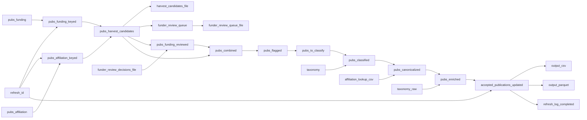
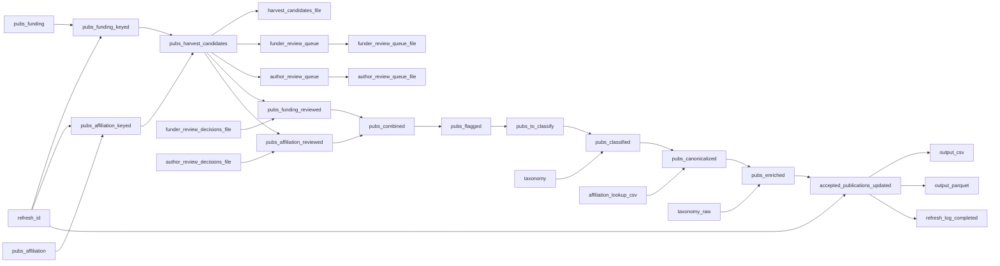

# DWR Publication Inventory — Analysis Plan

## Overview

This project produces a flat tabular inventory of peer-reviewed publications
funded and/or authored by the California Department of Water Resources (DWR),
with each publication classified into a user-defined scientific field taxonomy
using a large language model.

The pipeline is orchestrated with the
[`targets`](https://docs.ropensci.org/targets/) package. All bibliometric
retrieval and LLM classification is handled by the
[`pubclassify`](https://github.com/lucy-dwr/pubclassify) package.

---

## Repository Structure

```
_targets.R                              # Pipeline definition
R/                                      # Custom functions, sourced by tar_source("R/")
  add_record_keys.R                     # Assign stable record_key to each publication
  create_refresh_id.R                   # Refresh identity and log management
  save_harvest_candidates.R             # Persist harvest snapshots per refresh
  build_funder_review_queue.R           # Filter funder candidates needing manual review
  apply_review_decisions.R              # Apply keep/drop decisions from review
  append_accepted_publications.R        # Safe append to the accepted-publications table
  update_funding_division_lookup.R      # Keep-only funder DOI -> division lookup
  join_funding_division.R               # Join funding divisions into exports
  flag_dwr_contributions.R              # Add is_funder / is_author / … boolean flags
  score_dwr_relevance.R                 # Heuristic suspicion scoring for review
  apply_affiliation_lookup.R            # Canonicalize affiliation strings
  build_affiliation_lookup.R            # Build the affiliation lookup table (one-time)
  build_institution_reference.R         # Build institution reference list (one-time)
shiny/
  funder_review_app.R                   # Shiny app for manual funder review
  dashboard_app.R                       # Publication inventory dashboard
taxonomy/
  dwr_disciplines_taxonomy.csv          # Field taxonomy (columns: field, definition)
data/
  accepted_publications.parquet         # Durable source of truth for accepted records
  funding_division_lookup.csv           # Keep-only funder records with division assignments
  refresh_log.csv                       # One row per refresh cycle with counts
  review_decisions.csv                  # Manual decisions (columns: record_key, doi,
                                        #   decision, reviewed_at, review_refresh_id,
                                        #   review_notes)
  funder_review_queue.parquet           # Current funder review queue (written by pipeline)
  harvests/                             # Per-refresh candidate snapshots
  affiliation_lookup.csv                # Canonical institution name lookup
  dwr_publications.csv                  # Dashboard export (list cols collapsed)
  dwr_publications.parquet              # Dashboard export (native list cols)
```

---

## Configuration

Credentials are loaded from environment variables at pipeline runtime via
`pc_configure()`. `pc_configure()` is called once at the top of `_targets.R` (not
as a target). The following environment variables must be set:

| Variable                  | Purpose                                      |
|---------------------------|----------------------------------------------|
| `SCOPUS_API_KEY`          | Elsevier Scopus API key                      |
| `SCOPUS_INSTTOKEN`        | Elsevier institutional token (COMPLETE view) |
| `PUBCLASSIFY_LLM_KEY`     | API key for the OpenAI-compatible LLM        |
| `PUBCLASSIFY_LLM_BASE_URL`| `https://customeruat.sda.state.ca.gov/api/v1`|
| `PUBCLASSIFY_EMAIL`       | Email for OpenAlex polite pool (optional)    |

---

## Pipeline

### Target DAG

The pipeline uses an append-oriented refresh model. See `REFRESH_WORKFLOW.md`
for a full description of the design. The operator workflow is:

```r
targets::tar_make(funder_review_queue_file)  # Step 1: harvest + build funder queue
shiny::runApp("shiny/funder_review_app.R")   # Step 2: manual funder review
targets::tar_make()                          # Step 3: classify + append + export
```


```mermaid
flowchart LR
    refresh_id --> pubs_funding_keyed
    refresh_id --> pubs_affiliation_keyed
    pubs_funding  --> pubs_funding_keyed
    pubs_affiliation --> pubs_affiliation_keyed
    pubs_funding_keyed --> pubs_harvest_candidates
    pubs_affiliation_keyed --> pubs_harvest_candidates
    pubs_harvest_candidates --> harvest_candidates_file
    pubs_harvest_candidates --> funder_review_queue
    funder_review_queue --> funder_review_queue_file
    pubs_harvest_candidates --> pubs_funding_reviewed
    funder_review_decisions_file --> pubs_funding_reviewed
    pubs_funding_reviewed --> pubs_combined
    pubs_harvest_candidates --> pubs_combined
    pubs_combined --> pubs_flagged
    pubs_flagged --> pubs_to_classify
    pubs_to_classify --> pubs_classified
    taxonomy --> pubs_classified
    pubs_classified --> pubs_canonicalized
    affiliation_lookup_csv --> pubs_canonicalized
    pubs_canonicalized --> pubs_enriched
    taxonomy_raw --> pubs_enriched
    pubs_enriched --> accepted_publications_updated
    refresh_id --> accepted_publications_updated
    accepted_publications_updated --> output_csv
    accepted_publications_updated --> output_parquet
    accepted_publications_updated --> refresh_log_completed
```

---

### Target Descriptions

#### `taxonomy`

Load the custom field taxonomy from `taxonomy/dwr_taxonomy.csv` using
`pc_taxonomy()`. The CSV must have exactly two columns: `field` and
`definition`. This target will be invalidated automatically if the taxonomy
file changes, triggering reclassification.

```r
tar_target(
  taxonomy,
  pc_taxonomy("taxonomy/dwr_taxonomy.csv"),
  # Mark the CSV as a file dependency so edits invalidate this target
  # (wrap with tar_target format = "file" + read pattern, or use
  # a tarchetypes::tar_file_read() approach — to be decided at implementation)
)
```

---

#### `pubs_funding`

Search Scopus for publications acknowledging DWR as a funder the query string
"California Department of Water Resources".

```r
tar_target(
  pubs_funding,
  pc_search_scopus(
    query      = "California Department of Water Resources",
    field      = "funder",
    doc_type   = c("article", "review"),
    auto_fetch = FALSE
  )
)
```

---

#### Manual funder review (`shiny/funder_review_app.R`)

After `pubs_funding` is built, a Shiny app is available for manually
reviewing each publication to confirm it is genuinely a California DWR-funded
record. Launch it from the project root with:

```r
shiny::runApp("shiny/funder_review_app.R")
```

The app reads `data/funder_review_queue.parquet` (written by the
`funder_review_queue_file` pipeline target) and presents records in descending suspicion order so the most
likely false positives are reviewed first. For each publication the reviewer
sees the title, suspicion score, DOI, year/journal, author affiliations, funders,
grant numbers, and an embedded view of the paper. The queue only contains records
not already reviewed or accepted, so the app shows an empty-queue message when
there is nothing left to review.

**Suspicion scoring (`R/score_dwr_relevance.R`)** adds points for signals that
suggest a record is *not* a genuine CA DWR publication:

| Signal | Points |
|--------|--------|
| No California geographic mention across all text fields | +4 |
| No water-related topic in title or abstract | +4 |
| Domain keywords indicate an unrelated field (medicine, physics, etc.) | +3 |
| No US institution detected in author affiliations | +2 |

Maximum score: 13. High suspicion ≥ 7, medium ≥ 4, low < 4.

The reviewer assigns one of three decisions to each record:

| Decision | Meaning |
|----------|---------|
| `keep`   | Confirmed as a CA DWR-funded publication |
| `drop`   | Not a CA DWR publication — exclude from pipeline |
| `unsure` | Ambiguous — flagged for further review |

Decisions are written to `data/review_decisions.csv` in real time. The schema
is `record_key, doi, decision, reviewed_at, review_refresh_id, review_notes`.
The app resumes from the first unreviewed record on restart.

---

#### `funder_review_decisions_file`

Tracks `data/funder_review_decisions.csv` as a file dependency so that any
edits saved by the funder review app automatically invalidate
`pubs_funding_reviewed` and all downstream targets.

```r
tar_target(funder_review_decisions_file, "data/funder_review_decisions.csv", format = "file")
```

---

#### `pubs_funding_reviewed`

Filters the funder candidates from `pubs_harvest_candidates`, dropping records
marked `"drop"` and passing `"keep"` and `"unsure"` records through. Matching
uses `record_key` rather than DOI. Implemented by `apply_review_decisions()`.

```r
tar_target(
  pubs_funding_reviewed,
  apply_review_decisions(
    dplyr::filter(pubs_harvest_candidates,
                  grepl("funder", query_source, fixed = TRUE)),
    funder_review_decisions_file
  )
)
```

---

#### `pubs_affiliation`

Search Scopus for publications where at least one author is affiliated with
DWR using the query string "California Department of Water Resources".

```r
tar_target(
  pubs_affiliation,
  pc_search_scopus(
    query      = "California Department of Water Resources",
    field      = "affiliation",
    doc_type   = c("article", "review"),
    auto_fetch = FALSE
  )
)
```

---

#### `pubs_combined`

Combines `pubs_funding_reviewed` (reviewed funder candidates) with
affiliation-only records from `pubs_harvest_candidates`. Affiliation-only records
(`query_source == "affiliation"`) are never subject to manual review and always
pass through. Deduplication on `record_key` ensures no double-counting of
records that appear in both search results.

---

#### `pubs_flagged`

Add four boolean contribution columns to `pubs_combined`. These flags are not
mutually exclusive — a publication can both a funder flag and authorship flags.

| Column           | Definition                                |
|------------------|-------------------------------------------|
| `is_funder`      | DWR is acknowledged as a funder           |
| `is_author`      | At least one author is DWR-affiliated     |
| `is_lead_author` | The first-listed author is DWR-affiliated |
| `is_sole_author` | All authors are DWR-affiliated            |

The flags are nested: `is_sole_author → is_lead_author → is_author`. A record
can have `is_funder = TRUE` and more than one nested authorship flag set
simultaneously.

- `is_funder` is derived from `from_funder` provenance.
- `is_author` is derived from `from_affiliation` provenance.
- `is_lead_author` is computed by checking whether the first element of the
  `affiliations` list-column contains `"California Department of Water
  Resources"`.
- `is_sole_author` is computed by checking whether every element of the
  `affiliations` list-column contains `"California Department of Water
  Resources"`.

---

#### `pubs_classified`

Classify each publication into a scientific field from the taxonomy using the
OpenAI-compatible LLM endpoint hosted by the California Department of
Technology. Classification uses title and abstract as input text.

```r
tar_target(
  pubs_classified,
  pc_classify(
    pubs      = pubs_flagged,
    taxonomy  = taxonomy,
    provider  = "openai-compatible",
    model     = "<model name TBD>",
    api_key   = Sys.getenv("PUBCLASSIFY_LLM_KEY"),
    base_url  = Sys.getenv("PUBCLASSIFY_LLM_BASE_URL")
  )
)
```

The LLM model name is to be confirmed. Because the taxonomy has fewer than 40
fields, `use_embeddings = FALSE` (the default) is appropriate.

A custom `system_prompt` and `classify_instructions` should be developed and
passed to `pc_classify()` to guide the model. This will be drafted once the
taxonomy fields are finalized.

---

#### Institution canonicalization (`R/build_affiliation_lookup.R`)

After `pubs_classified` is built, a script is available to build a canonical
institution lookup table from the raw affiliation strings. Run it once from the
project root before building `pubs_canonicalized`:

```r
source("R/build_affiliation_lookup.R")
build_affiliation_lookup()
```

The script proceeds in three stages:

**Stage 1 — Extract unique raw strings.**  Flatten `pubs_classified$affiliations`
(a list column where each element is a character vector of per-author
affiliations) into a single character vector of unique raw strings. Each unique
string is the unit of work for the remainder of the process.

**Stage 2 — Cluster by string similarity.**  Compute pairwise string distances
(`stringdist` package, method `"jw"` or `"cosine"` on token sets) and apply
hierarchical clustering with a conservative threshold so that only near-certain
variants are grouped automatically. The output is a data frame with columns
`raw` and `cluster_id`. Cluster membership can be inspected and manually
corrected before proceeding.

**Stage 3 — LLM labels each cluster.**  For each cluster, send all member
strings together to the LLM with a structured prompt asking for a single
canonical institution name. The prompt includes:

- A **reference list** of expected institutions (all UC campuses, CSU campuses,
  major CA state agencies — DWR, DFW, SWRCB, etc. — and common federal agencies
  — USGS, BOR, EPA, NOAA) so the LLM matches against known names rather than
  generating freely.
- A **naming convention rule**: always use the full official name; for UC
  campuses use `"University of California, [City]"`.
- An instruction to return the sentinel `"UNKNOWN"` rather than guess when
  confidence is low. `UNKNOWN` entries are flagged for manual resolution.

The result is written to `data/affiliation_lookup.csv` with columns:

| Column      | Description                                      |
|-------------|--------------------------------------------------|
| `raw`       | Raw affiliation string as it appears in the data |
| `canonical` | Canonical institution name (or `"UNKNOWN"`)      |

The CSV should be reviewed before the pipeline proceeds. `UNKNOWN` entries and
any suspect canonicalizations can be corrected by editing the file directly.
Once approved, the file is tracked by the `affiliation_lookup_csv` target and
triggers `pubs_canonicalized` when changed.

---

#### `affiliation_lookup_csv`

Tracks `data/affiliation_lookup.csv` as a file dependency so that any manual
edits to the lookup table automatically invalidate `pubs_canonicalized` and all
downstream targets.

```r
tar_target(affiliation_lookup_csv, "data/affiliation_lookup.csv", format = "file")
```

---

#### `pubs_canonicalized`

Apply the approved affiliation lookup table to `pubs_classified`, replacing
every raw affiliation string in the `affiliations` list column with its
canonical institution name. Implemented by `apply_affiliation_lookup()` in `R/`.

```r
tar_target(
  pubs_canonicalized,
  apply_affiliation_lookup(pubs_classified, affiliation_lookup_csv)
)
```

After canonicalization, `pubs_canonicalized$affiliations` contains only
approved canonical institution names. The unique count of institutions across
the dataset is computable directly from this column.

---

#### `pubs_enriched`

Join the top-level science category from `taxonomy_raw` onto
`pubs_canonicalized` so that both the broad category and the detailed field are available as first-class columns in every downstream output. The new column `pc_category` is placed immediately before `pc_field` to keep the two
classification columns adjacent.

```r
tar_target(
  pubs_enriched,
  {
    category_lookup <- dplyr::select(taxonomy_raw, pc_category = category, pc_field = field)
    dplyr::left_join(pubs_canonicalized, category_lookup, by = "pc_field") |>
      dplyr::relocate(pc_category, .before = pc_field)
  }
)
```

`taxonomy_raw` already exists as a target, so no additional file dependency
is needed here. If `pc_field` contains a value not present in the taxonomy
the resulting `pc_category` will be `NA` for that record.

---

#### `accepted_publications_updated`

After enrichment, newly processed records are appended to
`data/accepted_publications.parquet` — the durable source of truth. Records
already present (by `record_key`) are never overwritten in default
(`new_records_only`) mode. The target returns the file path, which is used by
both export targets below.

#### `output_csv`

Reads `data/accepted_publications.parquet` and writes a flattened copy to
`data/dwr_publications.csv`, after joining `funding_division` from
`data/funding_division_lookup.csv`. List columns (`authors`, `affiliations`,
`funders`, `grant_numbers`) are collapsed to semicolon-delimited strings so the
file is readable in Excel and other tabular tools without any special handling.

#### `output_parquet`

Reads `data/accepted_publications.parquet`, joins `funding_division` from
`data/funding_division_lookup.csv`, and writes it to
`data/dwr_publications.parquet` using the `arrow` package. List columns are
preserved as Arrow list type, making this the preferred format for
`shiny/dashboard_app.R` and other downstream consumers.

---

## Output Schema

The pipeline produces two output files from the same underlying data:

| File                          | List columns  | Best for                              |
|-------------------------------|---------------|---------------------------------------|
| `data/dwr_publications.csv`   | Semicolon-delimited strings | Excel, simple tabular tools |
| `data/dwr_publications.parquet` | Native list type | Shiny, Streamlit, React/DuckDB  |

Both files contain the standard `pubclassify` columns plus the columns
added by this pipeline:

| Column             | Description                                              |
|--------------------|----------------------------------------------------------|
| `doi`              | Digital Object Identifier                                |
| `title`            | Article title                                            |
| `abstract`         | Article abstract                                         |
| `year`             | Publication year                                         |
| `doc_type`         | Document type (article, review, etc.)                    |
| `authors`          | Author display names (list column)                       |
| `affiliations`     | Canonical institution names per author (list column) — raw Scopus strings replaced by `pubs_canonicalized` |
| `funders`          | Funder names (list column)                               |
| `grant_numbers`    | Grant/contract numbers (list column)                     |
| `journal`          | Journal name                                             |
| `source`           | API source (`"scopus"`)                                  |
| `is_funder`        | DWR is a funder (boolean)                                |
| `is_author`        | At least one DWR author (boolean)                        |
| `is_lead_author`   | First author is DWR-affiliated (boolean)                 |
| `is_sole_author`   | All authors are DWR-affiliated (boolean)                 |
| `funding_division` | Manual DWR division assignment for kept funder-query records, joined from `data/funding_division_lookup.csv` |
| `pc_category`      | Broad science category joined from taxonomy (e.g. `"atmospheric sciences"`) |
| `pc_field`         | Assigned taxonomy field (e.g. `"climatology"`)           |
| `pc_rationale`     | LLM rationale for field assignment                       |
| `pc_text_source`   | Text used for classification (`"title+abstract"`)        |
| `pc_classified_by` | Classification method (`"llm-full"`)                     |

---

## Author Workflow

### Overview

The author workflow adds three capabilities that mirror the funder workflow:

1. **Author affiliation QC review** — A Shiny app for manually reviewing
   Scopus affiliation-query records to confirm DWR authorship. This replaces
   the current design where all affiliation records bypass review and pass
   through automatically.

2. **Institution canonicalization** — Already wired into the pipeline
   (`affiliation_lookup_csv` → `pubs_canonicalized`). The lookup CSV must be
   (re)built using `build_affiliation_lookup()` before this step can run;
   `data/affiliation_lookup.csv` is currently missing and needs to be
   regenerated. See the [Institution canonicalization](#institution-canonicalization-rbuildaffiliationlookupr)
   section above for the full three-stage process.

3. **Author division assignment** — A new join step that matches DWR author
   names and years against `data/author_division_lookup.csv` to assign the
   DWR division each author belonged to at time of publication.

---

### Updated Operator Workflow

```r
# Step 1: Harvest candidates and build both review queues
targets::tar_make(funder_review_queue_file, author_review_queue_file)

# Step 2a: Review funder candidates (confirms DWR funding; sets funding_division eligibility)
shiny::runApp("shiny/funder_review_app.R")

# Step 2b: Review author affiliation candidates (confirms DWR authorship; sets author_division eligibility)
shiny::runApp("shiny/author_review_app.R")

# Step 3: Classify + canonicalize + append + export
targets::tar_make()
```

Both review apps can be run in any order. Running Step 3 before finishing
both reviews is safe — unreviewed records pass through `apply_review_decisions()`
unchanged — but pipeline output will be incomplete until both reviews are done.

---

### Updated Target DAG


```mermaid
flowchart LR
    refresh_id --> pubs_funding_keyed
    refresh_id --> pubs_affiliation_keyed
    pubs_funding --> pubs_funding_keyed
    pubs_affiliation --> pubs_affiliation_keyed
    pubs_funding_keyed --> pubs_harvest_candidates
    pubs_affiliation_keyed --> pubs_harvest_candidates
    pubs_harvest_candidates --> harvest_candidates_file
    pubs_harvest_candidates --> funder_review_queue
    pubs_harvest_candidates --> author_review_queue
    funder_review_queue --> funder_review_queue_file
    author_review_queue --> author_review_queue_file
    funder_review_decisions_file --> pubs_funding_reviewed
    pubs_harvest_candidates --> pubs_funding_reviewed
    author_review_decisions_file --> pubs_affiliation_reviewed
    pubs_harvest_candidates --> pubs_affiliation_reviewed
    pubs_funding_reviewed --> pubs_combined
    pubs_affiliation_reviewed --> pubs_combined
    pubs_combined --> pubs_flagged
    pubs_flagged --> pubs_to_classify
    pubs_to_classify --> pubs_classified
    taxonomy --> pubs_classified
    pubs_classified --> pubs_canonicalized
    affiliation_lookup_csv --> pubs_canonicalized
    pubs_canonicalized --> pubs_enriched
    taxonomy_raw --> pubs_enriched
    pubs_enriched --> accepted_publications_updated
    refresh_id --> accepted_publications_updated
    accepted_publications_updated --> output_csv
    accepted_publications_updated --> output_parquet
    accepted_publications_updated --> refresh_log_completed
```

`join_author_division()` runs inside `output_csv` and `output_parquet` (same
pattern as `join_funding_division()`) so it does not appear as a separate
node. The `author_division` column is present in both export files.

---

### New Files

#### R functions

| File | Purpose |
|------|---------|
| `R/build_author_review_queue.R` | Build the author affiliation review queue |
| `R/score_author_affiliation.R` | Suspicion scoring for affiliation-query records |
| `R/join_author_division.R` | Match DWR author names to divisions and join into output |

#### Shiny app

| File | Purpose |
|------|---------|
| `shiny/author_review_app.R` | Manual author affiliation review app |

#### Data files (generated or pre-existing)

| File | Status | Purpose |
|------|--------|---------|
| `data/author_review_queue.parquet` | Generated by pipeline | Current author review queue |
| `data/author_review_decisions.csv` | Created by app on first decision | Manual author decisions |
| `data/author_division_lookup.csv` | Already exists (48,269 rows) | DWR staff name × year → division |
| `data/dwr_org_lookup.csv` | Already exists (78 rows) | Raw org label → canonical division |

---

### New `pipeline.yml` Paths

Add to the `paths:` section of `config/pipeline.yml`:

```yaml
paths:
  author_review_decisions: data/author_review_decisions.csv
  author_review_queue: data/author_review_queue.parquet
  author_division_lookup: data/author_division_lookup.csv
  dwr_org_lookup: data/dwr_org_lookup.csv
```

---

### New and Updated Targets

#### `author_review_queue`

Parallel to `funder_review_queue`. Filters affiliation-side candidates from
`pubs_harvest_candidates` that are not yet reviewed or accepted, then scores
and sorts them by descending suspicion. "Affiliation-side" means
`grepl("affiliation", query_source)` — this includes both strict
`"affiliation"` records **and** `"funder; affiliation"` overlap records, so
each overlap record is reviewed in both the funder queue and the author queue.

```r
tar_target(
  author_review_queue,
  build_author_review_queue(
    pubs_harvest_candidates,
    decisions_path = pipeline_config$paths$author_review_decisions,
    accepted_path  = pipeline_config$paths$accepted_publications,
    lookup_path    = pipeline_config$paths$author_division_lookup
  )
)
```

Implemented by `R/build_author_review_queue.R`. Structure mirrors
`build_funder_review_queue()` but uses
`grepl("affiliation", query_source, fixed = TRUE)` and scores using
`score_author_affiliation()`.

---

#### `author_review_queue_file`

Writes the queue to disk so the Shiny app can read it.

```r
tar_target(
  author_review_queue_file,
  {
    arrow::write_parquet(author_review_queue,
                         pipeline_config$paths$author_review_queue)
    pipeline_config$paths$author_review_queue
  },
  format = "file"
)
```

---

#### `author_review_decisions_file`

Tracks `data/author_review_decisions.csv` as a file dependency so edits
saved by the Shiny app invalidate `pubs_affiliation_reviewed` and all
downstream targets.

```r
tar_target(
  author_review_decisions_file,
  pipeline_config$paths$author_review_decisions,
  format = "file"
)
```

---

#### `pubs_affiliation_reviewed`

Applies the existing `apply_review_decisions()` to all affiliation-side
candidates (including overlap records) using the author decisions file.
Records marked `"drop"` are removed; `"keep"`, `"unsure"`, and unreviewed
records are retained.

```r
tar_target(
  pubs_affiliation_reviewed,
  apply_review_decisions(
    dplyr::filter(pubs_harvest_candidates,
                  grepl("affiliation", .data$query_source, fixed = TRUE)),
    author_review_decisions_file
  )
)
```

---

#### Updated `pubs_combined`

Replace the current affiliation passthrough with `pubs_affiliation_reviewed`
and add a `query_source` correction step so that `flag_dwr_contributions()`
assigns `is_funder` and `is_author` correctly for overlap records whose
funding or authorship was dropped in review.

**Before:**
```r
tar_target(
  pubs_combined,
  {
    affil_only <- dplyr::filter(pubs_harvest_candidates, .data$query_source == "affiliation")
    dplyr::bind_rows(pubs_funding_reviewed, affil_only) |>
      dplyr::distinct(.data$record_key, .keep_all = TRUE)
  }
)
```

**After:**
```r
tar_target(
  pubs_combined,
  {
    combined <- dplyr::bind_rows(pubs_funding_reviewed, pubs_affiliation_reviewed) |>
      dplyr::distinct(.data$record_key, .keep_all = TRUE)

    # For "funder; affiliation" overlap records, correct query_source based on
    # review outcomes so flag_dwr_contributions() sets is_funder / is_author correctly.
    # (Both decisions files are already transitive dependencies via the _reviewed targets.)
    read_drops <- function(path) {
      if (!file.exists(path)) return(character())
      d <- readr::read_csv(path, show_col_types = FALSE,
                           col_types = readr::cols(.default = readr::col_character()))
      d$record_key[!is.na(d$decision) & d$decision == "drop"]
    }
    funder_drops <- read_drops(pipeline_config$paths$funder_review_decisions)
    author_drops <- read_drops(pipeline_config$paths$author_review_decisions)

    dplyr::mutate(combined,
      query_source = dplyr::case_when(
        .data$record_key %in% funder_drops & .data$query_source == "funder; affiliation" ~ "affiliation",
        .data$record_key %in% author_drops & .data$query_source == "funder; affiliation" ~ "funder",
        TRUE ~ .data$query_source
      )
    )
  }
)
```

An overlap record dropped from funder review but kept in author review will
have `query_source` corrected to `"affiliation"`, so it contributes to
`is_author` but not `is_funder`. The reverse applies for a record kept as a
funder but dropped as an author.

---

#### Updated `output_csv` and `output_parquet`

Both export targets call `join_funding_division()`. Add `join_author_division()`
in the same pipeline:

```r
pubs <- arrow::read_parquet(accepted_publications_updated) |>
  join_funding_division(funding_division_lookup_updated) |>
  join_author_division(
    pipeline_config$paths$author_division_lookup,
    pipeline_config$paths$dwr_org_lookup
  )
```

---

### Manual Author Affiliation Review (`shiny/author_review_app.R`)

Near-identical structure to `shiny/funder_review_app.R`. Key differences:

| Aspect | Funder app | Author app |
|--------|-----------|------------|
| Queue file | `data/funder_review_queue.parquet` | `data/author_review_queue.parquet` |
| Decisions file | `data/review_decisions.csv` | `data/author_review_decisions.csv` |
| Sort field | `cdwr_score` desc | `caff_score` desc |
| Score label | "Suspicion score" | "Suspicion score (author)" |
| Primary question | Is DWR genuinely a funder? | Is this genuinely a DWR-authored paper? |
| Extra display fields | Funders, grant numbers | Authors (with DWR-match annotation), abstract |

**Left panel fields (author app):**

1. Title
2. Suspicion score badge (`caff_score`)
3. DOI
4. Year / Journal
5. **Authors** — list of all author names; any name with a year-match in
   `author_division_lookup.csv` is annotated `(DWR — Division Name)`; DWR-affiliated
   names with no lookup match are annotated `(DWR — not in lookup)`
6. **Affiliations** — per-author affiliation strings; DWR-containing strings
   are visually highlighted
7. Abstract (truncated at ~300 chars)
8. Keep / Drop / Unsure buttons, Back / Skip, DOI jump

The annotation in the Authors field (item 5) gives the reviewer the key
signal: a paper where the DWR-affiliated author has no match in the HR lookup
warrants closer scrutiny.

---

### Author Affiliation Suspicion Scoring (`R/score_author_affiliation.R`)

Adds a `caff_score` column (integer) to the author review queue. Higher score =
more likely to require verification. The function takes `pubs` and `lookup_path`
as arguments and loads the lookup internally.

| Signal | Points |
|--------|--------|
| No DWR author name+year found in `author_division_lookup.csv` | +5 |
| Affiliation string is a non-standard DWR name variant (missing "California" or "Water Resources") | +3 |
| Paper domain keywords suggest an unrelated field (medicine, physics, finance, etc.) | +2 |
| No California geographic mention across title, abstract, or affiliations | +2 |

Maximum score: 12. Thresholds: high ≥ 7, medium ≥ 4, low < 4.

---

### Author Division Assignment (`R/join_author_division.R`)

Joins the DWR division for each DWR-affiliated author into the publication
output, adding an `author_division` column.

#### Inputs

- `data/author_division_lookup.csv` — columns: `division`, `year`, `name`
  (48,269 rows; 7,537 unique names; 2013–2026)
- `data/dwr_org_lookup.csv` — columns: `original`, `division`
  (maps raw org-label variants to the canonical 35-division names)

`dwr_org_lookup.csv` is applied to the HR lookup at load time so `division`
values are already canonical before matching begins.

#### Name Matching Strategy

Both `score_author_affiliation()` (for the suspicion score) and
`join_author_division()` (for division assignment) need to match Scopus author
names against the HR lookup. Scopus names are typically `"LastName, F.M."` or
`"LastName, FirstName M."`; the lookup uses uppercase full names such as
`"JOHN A SMITH"`. A three-tier strategy handles the common cases:

**Tier 1 — Last name (exact) + first initial (exact):**
1. Parse Scopus name: split on the first `","` → `(last, rest)`. Strip
   periods and split `rest` on whitespace → take the first token as the
   first-name fragment; extract its first character as the first initial.
2. Normalize `last` to uppercase, strip non-alphabetic characters.
3. Check if any lookup entry for year ± 1 has the same normalized `last`
   and the same first initial.
4. Middle initials in either the Scopus name or the lookup are ignored at
   this tier — `"JOHN SMITH"` and `"JOHN A SMITH"` and `"J SMITH"` all
   match each other.

**Tier 2 — Jaro-Winkler similarity ≥ 0.92 on the full reconstructed name:**
1. Reconstruct the Scopus name as `FIRST [MIDDLE] LAST` after normalization.
2. Compute `stringdist::stringsim(scopus_name, lookup_name, method = "jw")`
   for all lookup entries in year ± 1 with the same last-name initial.
3. Count as a match if the maximum similarity ≥ 0.92.
4. This catches minor normalization artifacts (e.g., hyphenated names,
   accented characters) that survive after step 1 fails.

**Known gap — nicknames where the first initial differs:**
`"BOB SMITH"` (Scopus) vs `"ROBERT SMITH"` (lookup) — initial B ≠ R, so
neither tier matches. Jaro-Winkler on `"BOB SMITH"` vs `"ROBERT SMITH"`
also falls below 0.92. These cases will raise `caff_score` (author not found
in lookup), surfacing the paper for reviewer inspection. A nickname dictionary
could be added in a later iteration if lookup misses prove common; for now the
reviewer can confirm from the paper itself.

The `stringdist` package is already in scope (used by
`R/build_affiliation_lookup.R`).

#### Assignment Logic

For each publication:

1. Extract `authors` (list column) and `affiliations` (list column, same index
   position per author) and the `year`.
2. Identify DWR-affiliated authors: those whose affiliation string contains
   `"California Department of Water Resources"`.
3. For each DWR-affiliated author, attempt a normalized name+year match against
   the lookup.
4. Collect all matched canonical `division` values.
5. Collapse unique matched divisions to a semicolon-delimited string →
   `author_division`. Publications with no match get `author_division = NA`.

#### Function Signature

```r
join_author_division <- function(pubs, lookup_path, org_lookup_path) {
  # Returns pubs with author_division column added.
  # author_division: character, semicolon-joined unique canonical divisions,
  # or NA_character_ when no DWR author name+year match is found.
}
```

---

### Updated Output Schema

Add `author_division` to both export files, placed adjacent to
`funding_division`:

| Column | Description |
|--------|-------------|
| `author_division` | Semicolon-delimited canonical DWR division(s) of matched DWR author(s) at time of publication. `NA` when no author name+year match is found in `data/author_division_lookup.csv`. |

---

### Complexities and Open Questions

1. **Author name normalization is imperfect.** Scopus author names are often
   abbreviated to initials-only, and the HR lookup uses full legal names. The
   permissive middle-initial strategy reduces false non-matches but may produce
   occasional false matches for common last names. Unmatched records surface in
   the review app with a high `caff_score`; the reviewer can inspect and decide.

2. **Lookup coverage is not exhaustive.** `author_division_lookup.csv` covers
   2013–2026 but may omit contractors, interns, and part-time staff who published
   using a DWR affiliation. A consistently high miss rate for a particular year
   or name cluster is more likely to reflect a gap in the HR export than a false
   positive publication set, and should be investigated before dropping records.

3. **Multi-division publications.** A paper with DWR authors in two different
   divisions will have `author_division = "Division A; Division B"`. Downstream
   dashboard filters will need to split on `"; "` rather than treating the
   column as a single-valued field — the same pattern used for `affiliations`.
   `SPECS.md` should be updated to document the "Author Division" filter and
   its relationship to the existing "Division" (funding division) filter.

4. **Two separate review decision files.** The pipeline now manages
   `review_decisions.csv` (funder) and `author_review_decisions.csv` (author)
   as distinct file dependencies. The `refresh_log_completed` target currently
   counts only funder decisions; it should be extended to record
   `n_author_reviewed`, `n_author_kept`, `n_author_dropped`, and
   `n_author_unsure` so each refresh cycle has a complete audit record.

5. **Overlap records receive two independent reviews.** Records with
   `query_source == "funder; affiliation"` appear in both the funder queue
   (to confirm DWR funding) and the author queue (to confirm DWR authorship).
   Each review can independently result in keep/drop/unsure. A dropped funder
   decision does not automatically remove the record's authorship, and vice
   versa. `pubs_combined` corrects `query_source` for records where one side
   was dropped, so `flag_dwr_contributions()` sets `is_funder` and `is_author`
   correctly in the final output.

6. **Institution canonicalization is a prerequisite for export, not for review.**
   `data/affiliation_lookup.csv` is currently missing and must be rebuilt before
   `targets::tar_make()` can complete the full pipeline. The author review queue
   and review app can be used before canonicalization is done; author division
   assignment (which uses raw author names, not institution names) is also
   independent of canonicalization and can proceed in parallel.

7. **`build_funder_review_queue()` cannot be reused for the author queue.**
   It filters on `grepl("funder", query_source)`. A new
   `build_author_review_queue()` function using
   `grepl("affiliation", query_source)` is required. The
   `apply_review_decisions()` function is fully generic and reusable as-is
   for both decisions files.

---

## Open Questions / Deferred Decisions / Remaining Work

- **Acknowledgments text in funder review app** — the review app currently
  relies on Scopus-provided funder and grant number fields, which are
  inconsistently populated. Adding a free-text input to the app where the
  reviewer can paste the raw acknowledgments section from the paper would give
  a more reliable signal for confirming CA DWR funding. The pasted text could
  be saved alongside the keep/drop/unsure decision in `review_decisions.csv`
  and used to inform the `pubs_funding_reviewed` filter or a separate
  manual annotation column.

- **Remaining UNKNOWN affiliations** — some canonicalized affiliations in the
  file `affiliation_lookup.csv` are still "UNKNOWN" after a first pass because
  they require manual work to address.

- **Dashboard author division filter** — `SPECS.md` does not yet document how
  `author_division` surfaces in the dashboard. Because `author_division` can be
  multi-valued (semicolon-delimited), the filter must split on `"; "` rather
  than filtering the column directly. A decision is also needed on whether to
  combine `funding_division` and `author_division` into a single "Division"
  filter or expose them as separate controls.

- **`refresh_log_completed` author counts** — extend the target to record
  `n_author_reviewed`, `n_author_kept`, `n_author_dropped`, and
  `n_author_unsure` alongside the existing funder counts.
